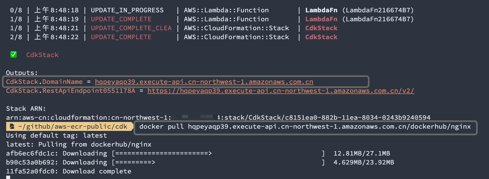

# Demo app to demonstrate use the library 'aws-ecr-proxy'

## Deploy with AWS CDK

You may deploy this service with AWS CDK to any AWS commercial regions including AWS China regions(`cn-north-1` and `cn-northwest-1`).

Cross-account Amazon ECR registry access is supported as well.


Install required npm modules

```bash
$ cd demo
$ npm install
```

To deploy it with Amaozn ECR of the same account as the origin

```bash
$ npx cdk --profile {YOUR_AWS_PROFILE} deploy
```

To deploy it with Amaozn ECR of another AWS account as the origin

```bash
$ npx cdk --profile {YOUR_AWS_PROFILE} deploy -c registry_id=ECR_REGISTRY_ID
```

To deploy it with [nwcdlabs/container-mirror](https://github.com/nwcdlabs/container-mirror) as the ECR upstream origin

```bash
$ npx cdk deploy --profile {YOUR_AWS_PROFILE} -c registry_id=048912060910      
```
Outputs
```
Outputs:
CdkStack.DomainName = c2rbvtozqf.execute-api.cn-northwest-1.amazonaws.com.cn
CdkStack.RestApiEndpoint0551178A = https://c2rbvtozqf.execute-api.cn-northwest-1.amazonaws.com.cn/v2/
```
* please note you will get a different unique `DomainName`

After deployment is completed, you will be able to `docker pull` images anonymously simply like this

```bash
# docker pull nginx images provided by NWCD
$ docker pull c2rbvtozqf.execute-api.cn-northwest-1.amazonaws.com.cn/dockerhub/nginx
```



## Destroy the Stack

```bash
$ npx cdk destroy
```